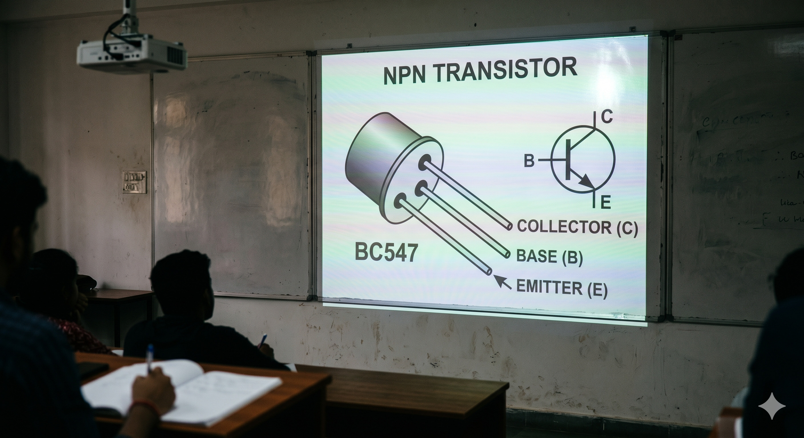

## A Random Developer

College came before all of this.

Back there, the world still looked understandable. At one point there was a
giant transistor projected on a wall and, for a brief glorious moment, it felt
as if the whole mystery of computing had opened itself. Every computer in the
world, from that view, seemed to be built from the same simple truth repeated
enough times.

Then came the real curriculum.

Multi-tier architecture. The `.NET` framework. Enterprise patterns. Everything a
company wanted to sell you immediately after you left college. There was also
one class where we used Java and only Java. Plain Java. Swing applications. JSP
servers. Strange shiny 3D objects. But the Java part was a good part. It stayed
close to basics. It stayed close to low-level techniques. It taught the kind of
things that make later abstractions easier to judge.

So I entered the real world of complexity the way many developers do: by trying
to design the perfect multi-tier architecture.

From 2013 to 2016 I was deep in that world. Spring. `GWT`. `Vaadin`. Java in
the web, Java in the backend, Java everywhere. It felt like the dream had
arrived: one language, end to end, limitless abstractions, no more impedance
mismatch, no more excuses. I thought I had finally found the grand
architectural answer.

And then immutable programming found its way in.

Not in a dramatic way. It was introduced to me to fill in the silences during
coffee time. Holistically. Casually. Persistently. The framing around it
mattered less at first than the idea itself. But it was good enough to keep the
conversation alive, so I kept listening.

And then it came. The real moment. Immutability.

Not as a buzzword. Not as a checkbox on a conference slide. As a proper
realization. A rearrangement of the furniture in the mind. Suddenly many of the
things I had spent years polishing looked upside down. I did not throw away all
of programming, but I did throw away many of the assumptions I had built around
it. I found myself drawn back to something more direct, more honest, less eager
to hide state changes behind layers of accidental cleverness.

After 2016 I started experimenting more seriously with immutability. Builder
patterns over DTOs. Event streaming. Better boundaries. Cleaner data flow. None
of it was pointless, but none of it was satisfying enough either. Something was
still missing.

Then 2018 arrived and with it an opportunity that only looks sensible in
retrospect. I had a chance to push this way of thinking into a major strategic
project in a big bank. As any reasonable crazy person would, I took it.

It was hell.

Endless hours. Endless false starts. Endless pressure to make the thing real.
But it was also one of those rare chances that only appears once in a while: the
chance to build a library around the one thing that still felt true after the
framework fog had cleared.

Make immutability the center.

Keep the core simple.

Do not hide the model.

That is how `edd-core` happened.

> **Did you know?** Immutable data is what makes safe concurrency *cheap*, not
> expensive. If nothing can change underneath you, there is no race to lose, no
> lock to acquire, and no defensive copy to make before passing a value to
> another thread. The "performance cost of immutability" is mostly the cost
> mutable code pays in locks, copies, and bugs \u2014 just paid somewhere else.

## What This Book Is

This book is not trying to sell a grand architecture. It is the story that comes
after becoming suspicious of grand architectures.

It explains `edd-core` as it is implemented in this repository: a small library
built around a few sharp tools. The main implementation here is in Clojure, and
a Java implementation is in progress as well.

- Commands for decisions.
- Events for durable facts.
- Event handlers for rebuilding aggregate state.
- Effects for follow-up commands.
- Queries for read paths.
- Identities for business-key lookups.

Those tools can support several styles of system design.

- Classic event-sourced systems.
- Service workflows.
- Ordinary CRUD applications that still want immutable history,
  predictable updates, and strong testability.

The important thing to understand is that EDD Core stays low level. It does not
hide the model from you. When a command is handled, the framework rebuilds the
current aggregate from stored state and newer events, runs your pure handler,
then stores the result. The mechanics stay visible, which is why the library is
simple to reason about.

## Who This Book Is For

- Engineers building services directly on `edd-core`.
- Engineers joining a codebase that already uses it.
- Teams that want immutable history without giving up straightforward product
  development.
- Teams that care about testability as much as features.

## How To Read It

| Part | Chapters | Focus |
| --- | --- | --- |
| Orientation | 1 | What EDD Core is and what problem it solves. |
| Foundations | 2–3 | Immutable history, stored facts, and aggregate reconstruction. |
| Core Primitives | 4–7 | Commands, Events, Effects, Queries. |
| System Design | 8–10 | Consistency, service boundaries, identifiers, tracing. |
| Practice | 11–12 | Testing, debugging vocabulary. |

The chapters build in order. By the end, you should be able to read the code in
this repository and understand what the library is doing, why it is doing it,
and where it is deliberately leaving choices to the application.

If the tone of the book sounds a little less like a product manual and a little
more like a developer finally learning what to keep and what to throw away,
that is intentional.
